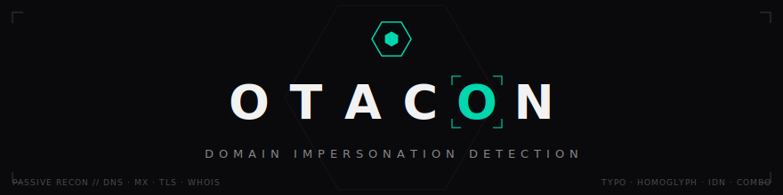

<p align="center">
  
</p>

<p align="center">
  <a href="https://github.com/notimeftnoir/otacon/actions"></a>
  
  
  
</p>

> **Otacon** finds domains impersonating yours — **typosquats, homoglyph fakes, combosquats, IDN/punycode tricks** and more. It generates hundreds of variants, checks which are actually registered, and scores each by real-world phishing risk. One command, ~10 seconds, no paid APIs.

```
⚠ 3 registered · crit: 1 · mx: 1 · fresh <7d: 1

Otacon · target: github.com
┌────────────────────────────────┬────────────────────┬──────────┬─────┬────┬─────┬──────┐
│ Domain                         │ Risk               │      Age │ DNS │ MX │ SSL │ HTTP │
├────────────────────────────────┼────────────────────┼──────────┼─────┼────┼─────┼──────┤
│ githubupdate.com               │ #######-  92 crit  │       3d │  +  │ +  │  +  │  200 │
│ combosquat . "GitHub - Security Update Required"                                       │
│ bithub.com                     │ #####---  68 high  │       2y │  +  │ -  │  +  │  301 │
│ typo                                                                                   │
│ githuub.com                    │ ####----  48 med   │      8mo │  +  │ -  │  -  │  404 │
│ typo                                                                                   │
└────────────────────────────────┴────────────────────┴──────────┴─────┴────┴─────┴──────┘
Permutations: 143 · registered: 3 · med: 1 · high: 1 · crit: 1
```

---

## Table of contents

- [Why Otacon?](#why-otacon)
- [Quick start](#quick-start)
- [Install](#install)
- [Usage](#usage)
- [Modes](#modes)
- [Output formats](#output-formats)
- [How scoring works](#how-scoring-works)
- [Detection techniques](#detection-techniques)
- [CI/CD integration](#cicd-integration)
- [Watch mode — continuous monitoring](#watch-mode--continuous-monitoring)
- [Interactive mode](#interactive-mode)
- [Whitelist / defensive flag](#whitelist--defensive-flag)
- [Comparison with dnstwist](#comparison-with-dnstwist)
- [FAQ](#faq)
- [Troubleshooting](#troubleshooting)
- [Contributing & development](#contributing--development)
- [License & ethics](#license--ethics)

---

## Why Otacon?

Phishing campaigns almost always start with a **lookalike domain**. Attackers register `github-update.com`, `paypa1.com`, `goog1e.com` weeks (or days) before the actual attack. By the time anyone notices, credentials are already gone.

Otacon is built for the people who need to find those domains **before the attack lands**:

| Role | Use case |
|---|---|
| **Pentester / red team** | Reconnaissance — find existing lookalikes against the client's brand to include in scope or use in social-engineering tests |
| **Blue team / SOC** | Continuous monitoring of your own domain — get paged when a new fake appears, especially one with MX or fresh registration |
| **Brand protection** | Audit hundreds of variants in one shot, export as JSON/HTML for the legal team or DMCA filings |
| **CI/CD gate** | Block deploys when a critical impersonation is live (`--fail-on critical`) |

Otacon is **fully passive**: DNS queries, a TLS handshake, one HTTP GET per variant. No exploit attempts, no auth, no scraping at scale.

---

## Quick start

```bash
pipx install git+https://github.com/notimeftnoir/otacon.git
otacon scan example.com
```

That's it. You get a colored terminal table, ranked by risk, in about 10 seconds.

Need a wordlist without network checks? `otacon generate example.com -o wordlist.txt`
Want guided mode? Just run `otacon` with no arguments.

---

## Install

**Recommended — isolated global install via [pipx](https://pipx.pypa.io):**

```bash
pipx install git+https://github.com/notimeftnoir/otacon.git
```

**Alternative — standard pip into any active virtual environment:**

```bash
pip install git+https://github.com/notimeftnoir/otacon.git
```

> **macOS / Kali / Debian:** the `aiodns` dependency needs the `c-ares` system library.
> `brew install c-ares` (macOS) · `sudo apt install libc-ares-dev` (Debian/Kali/Ubuntu)
>
> **Windows:** no extra deps — wheels are prebuilt. Otacon auto-switches to `SelectorEventLoop` to avoid known Proactor issues.

<details>
<summary><b>Development install (from source, with tests)</b></summary>

```bash
git clone https://github.com/notimeftnoir/otacon.git
cd otacon
python3 -m venv .venv
source .venv/bin/activate        # Linux / macOS
.venv\Scripts\activate           # Windows (PowerShell)
pip install -e ".[dev]"
pytest && ruff check .
```

</details>

---

## Usage

```bash
otacon                                        # interactive mode (guided prompts)
otacon scan example.com                       # one-shot scan, all signals
otacon scan example.com --no-http             # DNS only — faster, fewer signals
otacon scan example.com --all                 # include unregistered variants
otacon scan example.com --concurrency 100     # crank concurrency (default 50)
otacon scan example.com --exclude "alias.com,brand.io"
otacon scan example.com --exclude-file allowed.txt
otacon scan example.com --json r.json --html r.html --markdown r.md
otacon scan example.com --fail-on high        # CI gate — exit 2 on high/critical
otacon watch example.com --interval 24h       # continuous loop, baseline diff
otacon watch example.com --interval 6h \
  --notify https://hooks.example.com/abc      # POST diff JSON on high-risk changes
otacon generate example.com -o variants.txt   # wordlist only, no network
otacon --version                              # print version and exit
```

### CLI flags reference

| Flag | Default | Description |
|---|---|---|
| `--no-http` | off | Skip HTTP & TLS probing. DNS+MX+WHOIS only. Disables the ⚑ defensive flag. |
| `--all` | off | Show unregistered variants in the output. |
| `-c`, `--concurrency` | `50` | Max concurrent DNS/HTTP checks. Raise carefully — your resolver may rate-limit. |
| `-x`, `--exclude` | — | Comma-separated whitelist: `--exclude "alias.com,brand.io"` |
| `--exclude-file` | — | Path to a file with one domain per line. `#` starts a comment. |
| `--json` | — | Write the full report (every variant, every signal, every reason) to a file. |
| `--markdown` / `--md` | — | Write a Markdown table ready to paste into a ticket. |
| `--html` | — | Write a self-contained dark-theme HTML report. |
| `--fail-on` | — | `low` / `medium` / `high` / `critical` — exit `2` when any registered variant reaches this level. |
| `--interval` *(watch)* | once | Loop forever every `N{h,m,s}`. Omit for a single pass. |
| `--notify` *(watch)* | — | Webhook URL. POSTs the diff JSON when NEW or CHANGED domains are high/critical. |
| `-V`, `--version` | — | Print version and exit. |

### Exit codes (for CI gating)

| Code | Meaning |
|---|---|
| `0` | Clean — nothing at/above the `--fail-on` threshold |
| `1` | Runtime error (bad input, empty domain, file I/O error) |
| `2` | Threshold breached — at least one registered variant met `--fail-on` |

---

## Modes

Otacon has three subcommands plus an interactive guided mode:

| Mode | Network? | Use when |
|---|---|---|
| `scan` | yes | One-shot audit. Most common. |
| `watch` | yes | Continuous monitoring. Diff against a saved baseline. Webhook on high-risk changes. |
| `generate` | **no** | Offline wordlist generation. Useful for feeding into external tooling (`subfinder`, `nuclei`, etc.) or sanity-checking what Otacon *would* check. |
| *(no subcommand)* | yes | **Interactive mode** — guided prompts, then a post-scan action loop (open in browser, WHOIS, rescan, allow-list). |

---

## Output formats

One scan, four ways to consume it. Pick the one that fits your workflow:

| Format | Flag | Best for |
|---|---|---|
| **Rich terminal table** | *(default)* | Interactive triage — colors, risk bars, live streaming as hits arrive |
| **JSON** | `--json r.json` | Pipelines, SIEM ingestion, custom analytics. Includes `risk_reasons` for every variant. |
| **Markdown** | `--md r.md` | Paste straight into Jira / GitHub issues / Slack |
| **HTML** | `--html r.html` | Hand to legal / compliance / management. Self-contained dark-theme file, no external dependencies. |

You can pass all three export flags at once — every format is rendered from the same in-memory report, so they always agree.

### JSON structure (excerpt)

```json
{
  "target": "github.com",
  "started_at": "2026-06-08T14:23:01+00:00",
  "total_permutations": 143,
  "results": [
    {
      "domain": "githubupdate.com",
      "kind": "combosquat",
      "resolves": true,
      "has_mx": true,
      "has_ssl": true,
      "http_status": 200,
      "page_title": "GitHub - Security Update Required",
      "created_at": "2026-06-05T09:12:00+00:00",
      "age_days": 3,
      "risk_score": 92,
      "risk_level": "critical",
      "risk_reasons": [
        "technique: combosquat (+20)",
        "resolves to an IP (+10)",
        "has an MX record — ready for email phishing (+25)",
        "active SSL certificate (+15)",
        "responds HTTP 200 — active site (+15)",
        "registered 3 days ago (+20)"
      ],
      "is_likely_defensive": false
    }
  ]
}
```

Every score is fully decomposed — you can always answer *"why did this get 92?"*.

---

## How scoring works

Every score is the sum of **explicit, explainable signals** — no ML, no black box. Every reason is exposed in the JSON export (`risk_reasons`) and in the interactive detail view.

<details open>
<summary><b>Signal point values</b></summary>

| Signal | Points |
|---|---|
| **MX record** — ready for email phishing | +25 |
| **Technique** — homoglyph / IDN | +25 |
| &nbsp;&nbsp;subdomain spoof | +22 |
| &nbsp;&nbsp;combosquat | +20 |
| &nbsp;&nbsp;typo | +18 |
| &nbsp;&nbsp;soundsquat | +16 |
| &nbsp;&nbsp;bitsquat · vowel-swap | +15 / +14 |
| &nbsp;&nbsp;hyphenation · plural · TLD-swap | +12 / +10 / +10 |
| **Domain age** — &lt;7 days | +20 |
| &nbsp;&nbsp;&lt;30 days · &lt;90 days | +12 / +5 |
| **SSL** certificate active | +15 |
| **HTTP** 2xx live · 3xx redirect | +15 / +10 |
| &nbsp;&nbsp;4xx · 5xx | +5 / +3 |
| **Resolves** to an IP | +10 |
| **Redirects** elsewhere (non-2xx, non-3xx) | +5 |

Score is capped at 100. Unregistered domains always score 0.

</details>

### Risk levels

| Level | Score | Meaning |
|---|---|---|
| 🔴 **critical** | 80–100 | Active infrastructure + email-ready — treat as a live threat. Investigate immediately. |
| 🟠 **high** | 60–79 | Registered with serious signals (MX or live site). Add to monitoring; consider takedown. |
| 🟡 **medium** | 35–59 | Registered, some signals — worth watching. |
| 🔵 **low** | 15–34 | Registered, minimal signals. Could be parked / unused. |
| 🟢 **safe** | 0–14 | Unregistered or negligible. |

> 📐 Full architecture, pipeline, and design rationale → [`docs/DESIGN.md`](docs/DESIGN.md)

---

## Detection techniques

Otacon implements **11 permutation techniques** modeled on real-world attacks:

| Technique | Example (`example.com`) | Real attack vector |
|---|---|---|
| **Homoglyph** | `exаmple.com` *(Cyrillic а)* | Visual identity — humans can't tell the difference |
| **IDN / Punycode** | `xn--exmple-4ve.com` | ACE-encoded unicode that browsers may render natively |
| **Typo** | `exmple.com`, `exsmple.com`, `exampel.com` | Fat-finger typing on QWERTY keyboards |
| **Combosquat** | `example-login.com`, `secureexample.com` | Adds "trust" keyword — common in phishing email links |
| **TLD swap** | `example.io`, `example.xyz` | Same name, different (often cheap) TLD |
| **Subdomain spoof** | `example.com.login.net` | Original domain as a label; URL-bar trickery |
| **Bitsquat** | `dxample.com` (`e`→`d` is one bit flip) | DRAM/DNS memory errors flip a single bit |
| **Hyphenation** | `ex-ample.com` | Insert/remove a hyphen |
| **Soundsquat** | `egzample.com`, `eksample.com` | Phonetic substitution (ph/f, c/k, s/z, x/ks) |
| **Vowel swap** | `exomple.com`, `exumple.com` | Replace one vowel with another |
| **Plural** | `examples.com` | Singular ↔ plural variation |

The generator deduplicates results and **never includes the original domain** in the output.

---

## CI/CD integration

Add a brand-protection gate to your release pipeline. If a critical impersonation goes live, the pipeline fails.

### GitHub Actions

```yaml
name: brand-protection
on:
  schedule:
    - cron: "0 6 * * *"   # daily at 06:00 UTC
  workflow_dispatch:

jobs:
  scan:
    runs-on: ubuntu-latest
    steps:
      - uses: actions/setup-python@v5
        with:
          python-version: "3.12"
      - run: sudo apt-get install -y libc-ares-dev
      - run: pip install git+https://github.com/notimeftnoir/otacon.git
      - run: otacon scan example.com --json report.json --fail-on critical
      - if: failure()
        uses: actions/upload-artifact@v4
        with:
          name: otacon-report
          path: report.json
```

### GitLab CI

```yaml
brand-protection:
  image: python:3.12
  before_script:
    - apt-get update && apt-get install -y libc-ares-dev
    - pip install git+https://github.com/notimeftnoir/otacon.git
  script:
    - otacon scan $CI_PROJECT_NAME.com --html report.html --fail-on high
  artifacts:
    when: always
    paths: [report.html]
  only: { refs: [schedules] }
```

---

## Watch mode — continuous monitoring

`watch` re-runs the full pipeline, diffs against a saved baseline (`~/.otacon/<domain>.json`), and prints only what changed:

- **NEW** — variant registered since the last run
- **CHANGED** — score or level shifted (e.g., suddenly got an MX record)
- **GONE** — variant unregistered or fell off

```bash
otacon watch example.com --interval 6h \
  --notify https://hooks.slack.com/services/XXX/YYY/ZZZ \
  --json diff.json
```

The webhook fires **only on high-priority changes** (NEW or CHANGED domain at high/critical) — no noise from low-severity churn. The diff payload is the same `WatchDiff` model serialized as JSON, so it's easy to route to Slack, PagerDuty, or your own SIEM.

Interrupt with `Ctrl+C` — current iteration completes, then the loop exits cleanly.

---

## Interactive mode

Run `otacon` with no subcommand for a guided experience. After the scan, you can act on each registered domain individually:

```
Action for githubupdate.com:
  [*] [o]pen   — open in browser
      [w]hois  — show registration info
      [e]xport — save result as JSON
      [a]llow  — skip in this session
      [r]escan — re-check this domain now
      [b]ack   — pick a different domain
      [q]uit   — exit actions
```

Designed for triaging a fresh scan without leaving the terminal: open the suspicious site, check WHOIS, decide to allow-list or escalate.

---

## Whitelist / defensive flag

Brands often own their own lookalikes defensively (e.g., `google.com` owns `gooogle.com` and redirects it). Otacon flags these with ⚑ when the redirect points back to the original:

```
microsft.com    ⚑ → microsoft.com    crit(85) — but defensive
```

After the scan, Otacon offers to write all ⚑-flagged domains to `whitelist.txt`. Future runs in the same directory pick this file up automatically; you can also point at a custom file with `--exclude-file path/to/list.txt`.

Whitelist file format:

```
# defensive registrations, owned by us
gooogle.com
goggle.com
g00gle.com
```

Whitelisted domains are skipped before any network call — saving both time and quota.

---

## Comparison with dnstwist

[`dnstwist`](https://github.com/elceef/dnstwist) is the OG tool in this space. Otacon and dnstwist solve overlapping problems with different priorities.

| | **Otacon** | **dnstwist** |
|---|---|---|
| Risk **score** with explained signals | ✓ 0–100, every point sourced | ✗ raw signals only |
| Defensive-registration flag | ✓ ⚑ on redirect-to-original | ✗ |
| Watch mode with baseline diff | ✓ NEW/CHANGED/GONE | ✗ (re-run + diff manually) |
| Webhook on high-risk changes | ✓ | ✗ |
| CI/CD exit code gating | ✓ `--fail-on` | ✗ |
| Self-contained HTML report | ✓ dark theme, no JS | partial (`--format html`) |
| Interactive post-scan triage | ✓ open/whois/rescan/allow | ✗ |
| Permutation techniques | 11 | 13+ |
| Visual screenshots of pages | ✗ | ✓ |
| Fuzzy/phonetic dictionary attacks | ✓ soundsquat | ✓ |
| GeoIP / Whois enrichment | WHOIS only | both |

**Use dnstwist if** you want screenshots, fuzzy hashing, deeper enrichment.
**Use Otacon if** you want an opinionated risk score, defensive-flag detection, watch mode with webhook, and a CI-friendly exit code.

---

## FAQ

<details>
<summary><b>Is this legal? Does it touch the target domains?</b></summary>

Otacon performs only **passive recon**: standard DNS queries, a TLS handshake on :443 (no data exchange), and a single HTTP GET. No login attempts, no scanning, no scraping at scale. This is the same level of activity as visiting the page in a browser.

That said, use it on **your own domains** or **within authorized engagements**. See `LICENSE` and `SECURITY.md`.

</details>

<details>
<summary><b>Why no machine learning?</b></summary>

Because pentesters and SOC analysts need to *defend* their findings. "Our model gave it 87" is not a defensible answer. `risk_reasons` is. Every score in Otacon comes with the exact list of signals that produced it — auditable in five seconds, tunable in a one-line edit to `scoring.py`.

</details>

<details>
<summary><b>How fast is it?</b></summary>

A full scan with HTTP probing on a 150-permutation domain typically completes in **8–15 seconds** on a residential connection. DNS-only mode (`--no-http`) is roughly **3× faster**.

Bottlenecks are usually:
1. WHOIS query rate-limiting (we cap at 4 concurrent)
2. DNS resolver latency (default `--concurrency 50` is conservative; raise it on a server with a fast resolver)
3. The `c-ares` library — make sure it's installed natively, not falling back to Python's stdlib resolver

</details>

<details>
<summary><b>Will it find IDN homoglyph attacks (xn-- domains)?</b></summary>

Yes. The `IDN` technique generates punycode-encoded variants for each Unicode homoglyph. They show up as `xn--...` in the table. Score base is +25, same as homoglyph — these are the most dangerous because they render as the original glyph in most browsers.

</details>

<details>
<summary><b>Does it work on internationalized domains (non-ASCII targets)?</b></summary>

Partially. Otacon accepts unicode input but the permutation engine is tuned for ASCII labels. IDN/punycode encoding works for *output* (generated homoglyphs of an ASCII original). True i18n of the engine is on the roadmap.

</details>

<details>
<summary><b>Why does my scan show 0 results when I know there are fakes?</b></summary>

Most likely causes, in order:

1. **DNS-only mode missed them** — with `--no-http`, you only see variants that resolve. Try a full scan.
2. **They're behind Cloudflare / a CDN** — they resolve but the SSL/HTTP probe times out. Increasing `--concurrency` doesn't help; raise the per-request timeout in `resolver.py` if it's a recurring issue.
3. **Your DNS resolver is rate-limiting** — try with a different resolver or lower `--concurrency`.
4. **The fakes are on a TLD not in our default list** — open an issue with the TLD.

</details>

<details>
<summary><b>Where is the WHOIS data coming from?</b></summary>

We use [`asyncwhois`](https://pypi.org/project/asyncwhois/), which talks directly to TLD WHOIS servers (no third-party API, no quota). Some TLDs (e.g., `.ai`, `.io`) sometimes return rate-limited or stripped responses — in that case `age_days` will be `null` and the age-based scoring contribution is just skipped (graceful degradation).

</details>

<details>
<summary><b>How do I add my own permutation technique?</b></summary>

1. Add a value to the `PermutationType` enum in `models.py`
2. Add a `_my_technique(label: str) -> set[str]` function in `permutations.py`
3. Add it to the pipeline list in `generate()` — order matters for dedup priority
4. Add a base score in `scoring._KIND_BASE`
5. Open a PR with tests in `tests/test_permutations.py`

</details>

---

## Troubleshooting

| Symptom | Likely cause | Fix |
|---|---|---|
| `ModuleNotFoundError: aiodns` on install | `c-ares` system library missing | `apt install libc-ares-dev` / `brew install c-ares`, then reinstall |
| Scan hangs at "Checking variants" | DNS resolver unreachable or rate-limiting | Lower `--concurrency`, switch resolver (`1.1.1.1`, `8.8.8.8`) |
| WHOIS always `—` for `.ai` / `.io` / `.pl` | Registry WHOIS rate-limit | Re-run later; this is normal |
| Windows: `ConnectionResetError [WinError 10054]` | Should be auto-fixed in 1.0+ | Ensure you're on the latest version; this used the Proactor loop, we've switched to Selector on Windows |
| `Unverified HTTPS request` warnings | Suppressed intentionally — we probe bad certs on purpose | n/a, hidden by default |

If something still doesn't work, please [open an issue](https://github.com/notimeftnoir/otacon/issues) with:

- Otacon version (`otacon --version`)
- Python version, OS, and architecture
- The full command and (if safe to share) the target
- The error message or unexpected behavior

---

## Contributing & development

See [`CONTRIBUTING.md`](CONTRIBUTING.md) for the dev setup, lint, and test commands.

Quick summary:

```bash
git clone https://github.com/notimeftnoir/otacon.git
cd otacon
python -m venv .venv && source .venv/bin/activate  # or .venv\Scripts\activate
pip install -e ".[dev]"
pytest && ruff check .
```

Architecture deep-dive: [`docs/DESIGN.md`](docs/DESIGN.md).

Security disclosure policy: [`SECURITY.md`](SECURITY.md).

---

## License & ethics

**MIT License.** Use it freely.

Otacon is **passive only** — DNS queries, a TLS handshake, a single HTTP GET per variant. No exploit attempts, no brute-forcing, no auth.

**Use only on:**
- Domains you own
- Domains within an authorized security testing engagement (with written scope)
- Domains you have explicit permission to monitor

**Do not use to:** harass, dox, or build attack tooling. If you found this useful for a defense engagement, [say hi](https://github.com/notimeftnoir/otacon/issues) — feedback shapes the roadmap.
