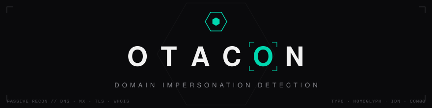
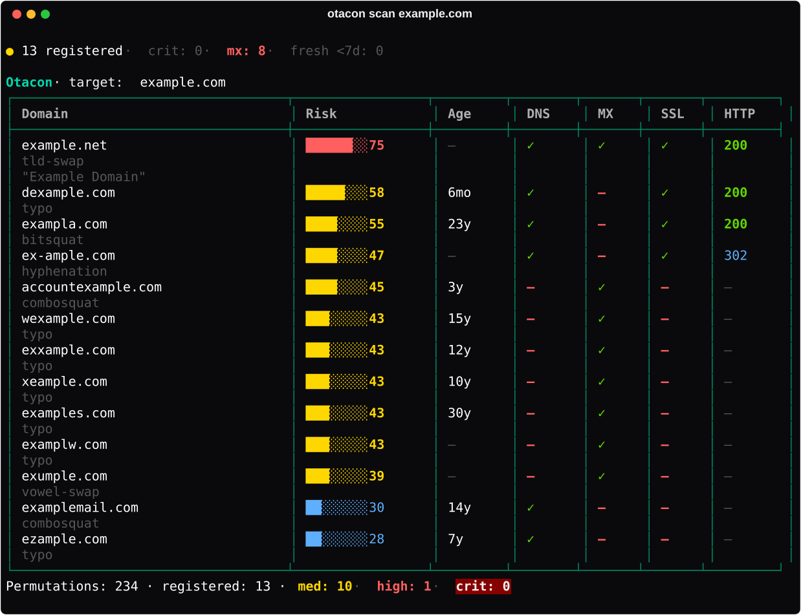

<p align="center">
  
</p>

<p align="center">
  <a href="https://github.com/notimeftnoir/otacon/actions/workflows/ci.yml"></a>
  <a href="https://github.com/notimeftnoir/otacon/actions/workflows/codeql.yml"></a>
  <a href="https://pypi.org/project/otacon/"></a>
  <a href="https://pypi.org/project/otacon/"></a>
  <a href="LICENSE"></a>
</p>

<p align="center">
  <a href="#detection-techniques"></a>
  <a href="docs/SCORING.md"></a>
  <a href="#license--ethics"></a>
  
</p>

<p align="center">
  <a href="#install"><b>Install</b></a> ·
  <a href="#quick-start"><b>Quick start</b></a> ·
  <a href="#detection-techniques"><b>Techniques</b></a> ·
  <a href="docs/USAGE.md"><b>Usage</b></a> ·
  <a href="docs/SCORING.md"><b>Scoring</b></a> ·
  <a href="docs/CI.md"><b>CI/CD</b></a> ·
  <a href="docs/FAQ.md"><b>FAQ</b></a>
</p>

> **Otacon** finds domains impersonating yours — **typosquats, homoglyph fakes, combosquats, IDN/punycode tricks** and more. It generates hundreds of variants, checks which are actually registered, and scores each by real-world phishing risk. One command, ~10 seconds, no paid APIs.

<p align="center">
  
</p>

<sub><i>Real output: a full scan of <code>example.com</code> — 234 permutations, 13 registered lookalikes, ranked by risk. Regenerate with <code>python tools/render_demo_svg.py</code>.</i></sub>

---

## Install

```bash
pipx install otacon      # isolated global install (recommended)
pip install otacon       # or into an active virtualenv
```

> **macOS / Debian / Kali:** the `aiodns` dependency needs the `c-ares` system library —
> `brew install c-ares` or `sudo apt install libc-ares-dev`.
> **Windows:** no extra steps, wheels are prebuilt.

## Quick start

```bash
otacon scan example.com                   # full scan: DNS, MX, TLS, HTTP, WHOIS
otacon scan example.com --no-http         # DNS only — roughly 3x faster
otacon scan example.com --fail-on high    # CI gate: exit 2 on high or critical
otacon generate example.com -o list.txt   # offline wordlist, no network traffic
otacon                                    # guided interactive mode
```

Global flags (`--quiet`, `--debug`, `--version`) go **before** the subcommand;
everything else goes after it.

| Exit code | Meaning |
|---|---|
| `0` | Clean — nothing at or above the `--fail-on` threshold |
| `1` | Runtime error (bad input, file I/O) |
| `2` | Threshold breached — at least one registered variant met it |

Reports are written with `--json`, `--md`, `--html` and `--csv`; pass as many as
you like, since every format renders from the same in-memory report.

---

## Why Otacon?

Phishing campaigns almost always start with a **lookalike domain**. Attackers register `github-update.com`, `paypa1.com`, `goog1e.com` weeks (or days) before the actual attack. By the time anyone notices, credentials are already gone.

Otacon is built for the people who need to find those domains **before the attack lands**:

| Role | Use case |
|---|---|
| **Pentester / red team** | Reconnaissance — find existing lookalikes against the client's brand to include in scope or use in social-engineering tests |
| **Blue team / SOC** | Scheduled audits of your own domain (e.g. a daily CI cron job) to catch a new fake fast, especially one with MX or fresh registration |
| **Brand protection** | Audit hundreds of variants in one shot, export as JSON/HTML for the legal team or DMCA filings |
| **CI/CD gate** | Block deploys when a critical impersonation is live (`--fail-on critical`) |

Otacon is **fully passive**: DNS queries, a TLS handshake, one HTTP GET per variant. No exploit attempts, no auth, no scraping at scale.

---

## Detection techniques

Otacon implements **12 permutation techniques** modeled on real-world attacks. The
homoglyph table is cross-checked against Unicode's own
[confusables.txt](https://www.unicode.org/Public/security/latest/confusables.txt)
so every look-alike character is a documented substitution, not a guess — it
covers all 26 letters, not just the handful that are easy to eyeball.

| Technique | Example (`example.com`) | Real attack vector |
|---|---|---|
| **Homoglyph** | `examp1e.com`, `ex4mple.com` | Visual identity — humans can't tell the difference |
| **IDN / Punycode** | `xn--exampe-7db.com` *(`l` → ł)* | ACE-encoded unicode that browsers may render natively |
| **Typo** | `exmple.com`, `exsmple.com`, `exampel.com` | Fat-finger typing on QWERTY keyboards |
| **Combosquat** | `example-login.com`, `secureexample.com` | Adds "trust" keyword — common in phishing email links |
| **TLD swap** | `example.io`, `example.top`, `example.icu` | Same name, different (often cheap/abused) TLD |
| **Subdomain spoof** | `example.com.login.net` | Original domain as a label; URL-bar trickery |
| **Bitsquat** | `axample.com` (`e`→`a` is one bit flip) | DRAM/DNS memory errors flip a single bit |
| **Hyphenation** | `ex-ample.com` | Insert/remove a hyphen |
| **Soundsquat** | `eksample.com` | Phonetic substitution (ph/f, c/k, s/z, x/ks) |
| **Vowel swap** | `exomple.com`, `exumple.com` | Replace one vowel with another |
| **Plural** | `shops.com` ← `shop.com` | Singular ↔ plural variation |
| **WWW-merge** | `wwwexample.com` | Dot dropped between "www" and the domain — easy to misread |

Every example above is real output, not an illustration. Each variant is
reported once, under the first technique that produced it, and the original
domain is never included — see [`docs/USAGE.md`](docs/USAGE.md#reading-a-report)
for why that matters when you read a report.

---

## Documentation

| Document | What's in it |
|---|---|
| [`docs/USAGE.md`](docs/USAGE.md) | Every CLI flag, the three modes, interactive triage, whitelisting |
| [`docs/SCORING.md`](docs/SCORING.md) | Every signal and its point value, risk-level thresholds |
| [`docs/OUTPUT.md`](docs/OUTPUT.md) | The five output formats and the JSON schema |
| [`docs/CI.md`](docs/CI.md) | Ready-to-paste GitHub Actions and GitLab CI pipelines |
| [`docs/FAQ.md`](docs/FAQ.md) | Legality, speed, IDN handling, troubleshooting |
| [`docs/DESIGN.md`](docs/DESIGN.md) | Architecture and design rationale |

---

## Comparison with dnstwist

[`dnstwist`](https://github.com/elceef/dnstwist) is the OG tool in this space. Otacon and dnstwist solve overlapping problems with different priorities.

| | **Otacon** | **dnstwist** |
|---|---|---|
| Risk **score** with explained signals | ✓ 0–100, every point sourced | ✗ raw signals only |
| Defensive-registration flag | ✓ ⚑ on redirect-to-original | ✗ |
| CI/CD exit code gating | ✓ `--fail-on` | ✗ |
| Self-contained HTML report | ✓ dark theme, no JS | partial (`--format html`) |
| Interactive post-scan triage | ✓ open/whois/rescan/allow | ✗ |
| Permutation techniques | 12 | 13+ |
| Visual screenshots of pages | ✗ | ✓ |
| Fuzzy/phonetic dictionary attacks | ✓ soundsquat | ✓ |
| GeoIP / Whois enrichment | WHOIS only | both |

**Use dnstwist if** you want screenshots, fuzzy hashing, deeper enrichment.
**Use Otacon if** you want an opinionated risk score, defensive-flag detection, and a CI-friendly exit code.

---

## Contributing

See [`CONTRIBUTING.md`](CONTRIBUTING.md) for the dev setup and the lint gates,
and [`SECURITY.md`](SECURITY.md) for the disclosure policy.

---

## License & ethics

**MIT License.** Use it freely.

Otacon is **passive only** — DNS queries, a TLS handshake, a single HTTP GET per variant. No exploit attempts, no brute-forcing, no auth.

**Use only on:**
- Domains you own
- Domains within an authorized security testing engagement (with written scope)
- Domains you have explicit permission to monitor

**Do not use to:** harass, dox, or build attack tooling. If you found this useful for a defense engagement, [say hi](https://github.com/notimeftnoir/otacon/issues) — feedback shapes the roadmap.
